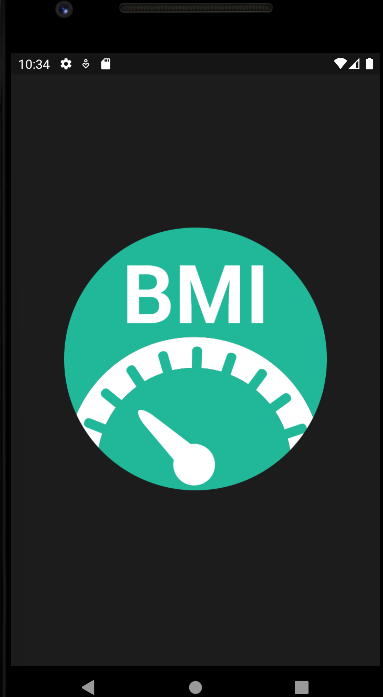
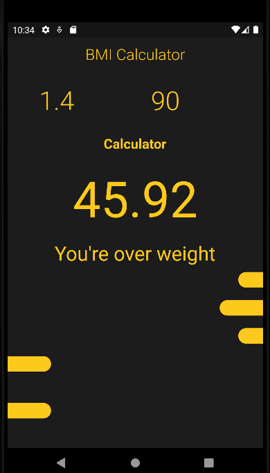

# bmi_calculator

<p align="center"> 
  <tr>
     <td></td>
  </tr>
  <h2 align="center">Flutter BMI Calculator App UI Design<h2>
 </p>
 
 ## Development Setup
Clone the repository and run the following commands:
```
flutter pub get
flutter run
```

### UI Source : https://www.figma.com/file/HruDWianqt6WY4kgYVxMUO/Untitled?node-id=0%3A1
 
 ## Screenshots
  

